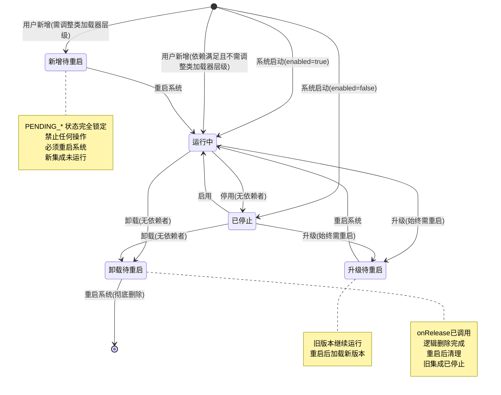

# ECAT 集成状态管理设计

## 概述

本文档定义了 ECAT 系统中集成的生命周期状态和状态转换规则，用于统一管理集成的安装、启用、停用、卸载等操作。

## 状态定义

| 状态 | 代码 | 说明 | 设备状态 | 内存 | 类加载器 | 可执行操作 |
|------|------|------|----------|------|----------|-----------|
| **运行中** | `RUNNING` | 功能正常加载和使用 | 运行中 | 占用 | 活跃 | 停用、卸载、升级 |
| **已停止** | `STOPPED` | 暂时停止，可恢复 | 已停止 | 占用 | 活跃 | 启用、卸载、升级 |
| **新增待重启** | `PENDING_ADDED` | 新安装，需调整类加载器层级，重启生效 | 不运行 | 不占用 | 未加载 | **禁止操作** |
| **升级待重启** | `PENDING_UPGRADE` | 升级中，旧版本继续运行 | 运行中(旧版本) | 占用 | 活跃(旧版本) | **禁止操作** |
| **卸载待重启** | `PENDING_REMOVED` | 已逻辑删除(onRelease已调用)，需重启清理 | 运行中 | 占用 | 活跃 | **禁止操作** |
| **已删除** | - | 彻底移除（仅重启后） | - | - | - | - |

> **核心设计原则**：
> - **新增**：依赖满足且不需调整类加载器层级 → RUNNING（热加载）；需调整层级 → PENDING_ADDED
> - **卸载**：检查依赖（无依赖者）→ 调用 onRelease → PENDING_REMOVED
> - **升级**：始终 → PENDING_UPGRADE，旧版本继续运行
> - **停用/启用**：热操作，调用 onPause/onStart
>
> **重要约束**：一旦进入 PENDING_* 状态，该集成被完全锁定，禁止任何操作，必须重启系统才能解决

## 状态转换图



## 转换说明

| 转换 | 说明 | 条件 |
|------|------|------|
| **系统启动 → 运行中** | 根据配置文件 `enabled: true` 加载集成 | 配置启用且无 `_deleted` 标记 |
| **系统启动 → 已停止** | 根据配置文件 `enabled: false` 跳过加载 | 配置禁用 |
| **用户新增 → 运行中** | 热加载集成 | 依赖满足且不需调整类加载器层级 |
| **用户新增 → 新增待重启** | 标记为待重启，需调整类加载器层级 | 需要调整已加载集成的类加载器结构 |
| **运行中 → 已停止** | 调用 onPause，暂停集成 | 无依赖者 |
| **运行中 → 升级待重启** | 标记版本升级，旧版本继续运行 | 新版本 JAR 已下载到本地 |
| **运行中 → 卸载待重启** | 调用 onRelease，标记逻辑删除 | 无依赖者 |
| **已停止 → 运行中** | 调用 onStart，恢复集成 | - |
| **已停止 → 升级待重启** | 标记版本升级 | 新版本 JAR 已下载到本地 |
| **已停止 → 卸载待重启** | 调用 onRelease，标记逻辑删除 | 无依赖者 |
| **新增待重启 → 运行中** | 重启后加载新集成 | 系统重启 |
| **升级待重启 → 运行中** | 重启后加载新版本 | 系统重启 |
| **卸载待重启 → 已删除** | 重启后彻底清理 | 系统重启 |

> **类加载器层级调整示例**：
> - 独立集成（如 `integration-sailhero`）新增后被其他集成依赖 → 需要升级为被依赖节点 → 需要重启
> - 被依赖集成（如 `integration-ecat-common`）新增时不需要调整层级 → 可热加载

## 详细状态转换表

### 系统启动时

| 操作 | 目标状态 | 条件 |
|------|----------|------|
| 加载集成 | 运行中 | 配置 `enabled: true` 且无 `_deleted` 标记 |
| 跳过集成 | 已停止 | 配置 `enabled: false` |
| 清理集成 | 已删除 | 配置有 `_deleted: true`，从配置中移除 |

### 用户新增集成

| 操作 | 目标状态 | 条件 |
|------|----------|------|
| 热加载 | 运行中 | 依赖满足且不需调整类加载器层级 |
| 标记待重启 | 新增待重启 | 需要调整已加载集成的类加载器层级 |

### 从 运行中 (RUNNING)

| 操作 | 目标状态 | 条件 |
|------|----------|------|
| 停用 | 已停止 | 无依赖者 |
| 升级 | 升级待重启 | 新版本 JAR 已下载到本地 Maven 仓库 |
| 卸载 | 卸载待重启 | 无依赖者，调用 onRelease |

### 从 已停止 (STOPPED)

| 操作 | 目标状态 | 条件 |
|------|----------|------|
| 启用 | 运行中 | - |
| 升级 | 升级待重启 | 新版本 JAR 已下载到本地 Maven 仓库 |
| 卸载 | 卸载待重启 | 无依赖者，调用 onRelease |

### 待重启状态处理

| 当前状态 | 操作 | 目标状态 | 触发条件 |
|----------|------|----------|----------|
| 新增待重启 | 重启系统 | 运行中 | 系统重启后加载 |
| 升级待重启 | 重启系统 | 运行中 | 系统重启后加载新版本 |
| 卸载待重启 | 重启系统 | 已删除 | 系统重启后清理配置和类加载器 |

> **注意**：PENDING_* 状态下禁止任何其他操作，包括恢复、取消等

## 不允许的转换（有条件限制）

| 当前状态 | 操作 | 拒绝条件 | 解决方案 |
|----------|------|----------|----------|
| 运行中 | 停用 | 有依赖者 | 先卸载依赖者 |
| 运行中 | 卸载 | 有依赖者 | 先卸载依赖者 |
| 已停止 | 卸载 | 有依赖者 | 先卸载依赖者 |
| 任何 PENDING_* | 任何操作 | 已进入待重启状态 | 必须重启系统才能解决 |

## 配置文件状态（唯一数据源）

配置文件是集成状态的唯一数据源，运行状态与配置文件保持同步。

```yaml
# .ecat-data/core/integrations.yml
integrations:
  # 启用的集成（运行中）
  com.ecat:integration-sensecap:
    enabled: true
    state: RUNNING
    groupId: com.ecat
    artifactId: integration-sensecap
    version: 1.0.0
    update: "2026-01-25 10:00:00"

  # 停用的集成（已暂停）
  com.ecat:integration-davis:
    enabled: false
    state: STOPPED
    groupId: com.ecat
    artifactId: integration-davis
    version: 1.0.0
    update: "2026-01-25 09:00:00"

  # 新安装的集成，待重启加载
  com.example:integration-new:
    enabled: true
    state: PENDING_ADDED
    groupId: com.example
    artifactId: integration-new
    version: 1.0.0
    update: "2026-01-25 11:00:00"

  # 升级中的集成，待重启
  com.ecat:integration-modbus:
    enabled: true
    state: PENDING_UPGRADE
    groupId: com.ecat
    artifactId: integration-modbus
    version: 2.0.0
    oldVersion: 1.0.0
    update: "2026-01-25 12:00:00"

  # 已删除的集成，待重启清理
  com.old:integration-old:
    enabled: false
    state: PENDING_REMOVED
    groupId: com.old
    artifactId: integration-old
    version: 1.0.0
    _deleted: true
    update: "2026-01-25 08:00:00"
```

### 配置与状态同步规则

| 操作 | 配置文件变化 | 运行状态变化 | 是否需重启 |
|------|-------------|-------------|-----------|
| 停用集成 | `enabled: false` | 调用 onPause → `STOPPED` | 否 |
| 启用集成 | `enabled: true` | 调用 onStart → `RUNNING` | 否 |
| 卸载集成 | 添加 `_deleted: true` | 调用 onRelease → `PENDING_REMOVED` | 是（重启后清理） |
| 安装集成 | 添加配置条目 | `RUNNING` 或 `PENDING_ADDED` | 视类加载器调整需求 |
| 升级集成 | `version: 新版本` + `pendingVersion: 旧版本` | `PENDING_UPGRADE` | 是（新版本 JAR 下载后标记） |
| 重启系统 | 清理 `_deleted` 条目 | 相应状态加载/清理 | - |

## 数据结构定义

```java
/**
 * 集成状态枚举
 */
public enum IntegrationState {
    RUNNING("运行中", "功能正常运行"),
    STOPPED("已停止", "暂时停止，可恢复"),
    PENDING_ADDED("新增待重启", "新安装，需重启生效"),
    PENDING_UPGRADE("升级待重启", "升级中，旧版本继续运行，等待重启"),
    PENDING_REMOVED("卸载待重启", "已逻辑删除，需重启清理");

    private final String name;
    private final String description;

    IntegrationState(String name, String description) {
        this.name = name;
        this.description = description;
    }
}

/**
 * 集成状态信息
 */
public class IntegrationStatus {
    private String coordinate;            // 集成坐标 (groupId:artifactId)
    private IntegrationState state;      // 当前状态
    private String message;              // 状态消息
    private List<String> dependents;     // 依赖此集成的其他集成
    private List<String> dependencies;   // 此集成的依赖
    private boolean canDisable;          // 是否可以停用（无依赖者且非 PENDING 状态）
    private boolean canRemove;           // 是否可以卸载（无依赖者且非 PENDING 状态）
    private boolean canEnable;           // 是否可以启用（非 PENDING 状态）
    private boolean canUpgrade;          // 是否可以升级（新版本 JAR 已下载且非 PENDING 状态）
    private boolean isLocked;            // 是否处于 PENDING_* 状态（禁止操作）
    private String version;              // 当前版本号
    private String pendingVersion;       // 待升级的版本号
    private Date lastUpdate;            // 最后更新时间

    // getters and setters
}
```

## 用户界面提示

根据集成状态，向用户显示不同的操作选项和提示信息：

| 状态 | 显示操作 | 提示信息 |
|------|----------|----------|
| 运行中 | [停用] [卸载] [升级] | 功能正常运行中 |
| 已停止 | [启用] [卸载] [升级] | 已暂停，可随时恢复 |
| 新增待重启 | [等待重启] | 新集成需要调整类加载器层级，请重启系统以加载 |
| 升级待重启 | [等待重启] | 版本已更新，旧版本继续运行，请重启系统以加载新版本 |
| 卸载待重启 | [等待重启] | 集成已逻辑删除，请重启系统以彻底清理 |


**测试覆盖**:

| 测试用例 | 场景 | 验证点 |
|---------|------|--------|
| TC-001 | 停用 sailhero → STOPPED | 状态转换、配置同步 |
| TC-002 | 停用 env-alarm-manager → STOPPED | 状态转换、配置同步 |
| TC-003 | 停用 serial（被依赖） | 预期拒绝、依赖检查 |
| TC-004 | 停用 ecat-common（被依赖） | 预期拒绝、多依赖者检查 |
| TC-005 | 停用 ecat-core-ruoyi（被依赖） | 预期拒绝、依赖检查 |
| TC-006 | 启用 sailhero → RUNNING | 状态转换、配置同步 |
| TC-007 | 启用 env-alarm-manager → RUNNING | 状态转换、配置同步 |
| TC-008 | 卸载 sailhero → PENDING_REMOVED | AB测试、状态锁定 |
| TC-009 | 卸载 env-alarm-manager → PENDING_REMOVED | AB测试、状态锁定 |
| TC-010 | 卸载 serial（被依赖） | 预期拒绝、依赖检查 |
| TC-011 | 卸载 ecat-common（被依赖） | 预期拒绝、多依赖者检查 |

**附加测试**:
- `testPendingStateLocking()`: 验证 PENDING_* 状态的锁定行为
- `testNoDependentsValidation()`: 验证无依赖者的集成操作权限
- `testWithDependentsValidation()`: 验证有依赖者的集成操作限制
- `testIntegrationManagerBasicOperations()`: 验证基本操作
- `testStateNamesAndDescriptions()`: 验证状态名称和描述
- `testConfigFileOperations()`: 验证配置文件操作
